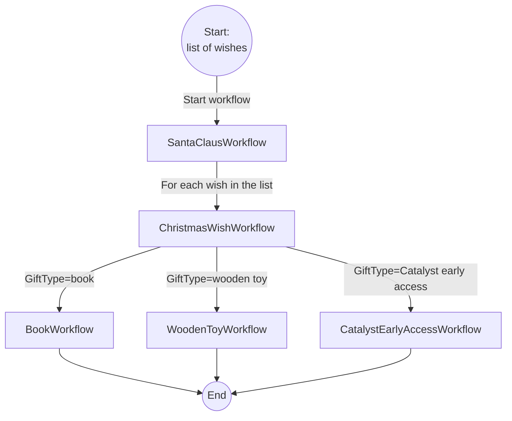

# Santa Claus Workflow

> This demo is created for [Festive Tech Calendar 2023](https://festivetechcalendar.com/).

Santa Claus is using [Dapr](https://dapr.io/) to ensure everyone gets their Christmas gift on time in the holiday season. He has a large and diverse team of elves who are responsible for different tasks such as making toys, wrapping gifts, and loading the sleigh. Each task is an activity that can be executed by one or more elves. Santa needs to coordinate the activities of all the elves in a reliable and efficient way.

That's where [Dapr Workflow](https://docs.dapr.io/developing-applications/building-blocks/workflow/workflow-overview/) comes in. Santa defines his workflow in code (he prefers C#, but Python or Java can also be used) where he specifies the sequence and conditions of the activities. Dapr Workflow takes care of the orchestration logic, fault tolerance, and scalability of the workflow, so Santa can focus on the business logic is assured of optimal elf efficiency.

## Workflow overview

These are the workflows Santa is using:



- [SantaClausWorkflow](./SantaClausWorkflow/Workflows/SantaClausWorkflow.cs): The main workflow that takes an array of wishes and starts a child workflow (ChristmasWishWorkflow) for each of the wishes.
- [ChristmasWishWorkflow](./SantaClausWorkflow/Workflows/ChristmasWishWorkflow.cs): This workflow contains activities to check if the person is naughty or nice, and if they are nice, a gift is selected and registered for that person. Based on the type of gift, another child workflow (BookWorkflow, WoodenToyWorkflow, CatalystEarlyAccessWorkflow) is started to make the gift. Once that child workflow is finished, activities are called to wrap the gift and load it into the sleigh.
- [BookWorkflow](./SantaClausWorkflow/Workflows/BookWorkflow.cs): This workflow contains activities to prepare a book as a gift.
- [WoodenToyWorkflow](./SantaClausWorkflow/Workflows/WoodenToyWorkflow.cs): This workflow contains activities to build a wooden toy. It calls activities to lookup the parts, assemble the parts, and paint the toy.
- [CatalystEarlyAccessWorkflow](./SantaClausWorkflow/Workflows/CatalystEarlyAccessWorkflow.cs): This workflow contains one activity that returns a link to get early access to Diagrid Catalyst, so they can make complex architectures simple, reliable and secure with APIs that connect to their existing infrastructure and work with their existing code.

## Prerequisites

1. [.NET 7 SDK](https://dotnet.microsoft.com/download/dotnet/7.0)
2. [Dapr CLI](https://docs.dapr.io/getting-started/install-dapr-cli/)
   - Ensure that you're using v1.12 (or higher) of the Dapr runtime and the CLI.
3. A REST client, such as [cURL](https://curl.se/), or the VSCode [REST client extension](https://marketplace.visualstudio.com/items?itemName=humao.rest-client).

## Running the solution locally

To run the SantaWorkflow:

1. Build the solution:

    ```bash
    dotnet build
    ```

2. Use the Dapr CLI to run the web app:

    ```bash
    dapr run -f .
    ```

3. Use the HTTP endpoints in the [local-workflow-test.http](./local-workflow-tests.http) file to start the workflow and check the status.

    **Start the workflow:**

    ```http
    @app_url=http://localhost:5065
    // @name startRequest
    POST {{app_url}}/start
    Content-Type: application/json

    [
        {
            "Name" : "Alex",
            "GiftType" : "WoodenToy"
        },
        {
            "Name" : "Rene",
            "GiftType" : "Book"
        },
        {
            "Name" : "Robin",
            "GiftType" : "CatalystEarlyAccess"
        }
    ]
    ```

    **Get the workflow status:**

    ```http
    @dapr_url=http://localhost:3500
    @instanceId={{startRequest.response.body.*}}
    GET {{dapr_url}}/v1.0-beta1/workflows/dapr/{{instanceId}}
    ```
